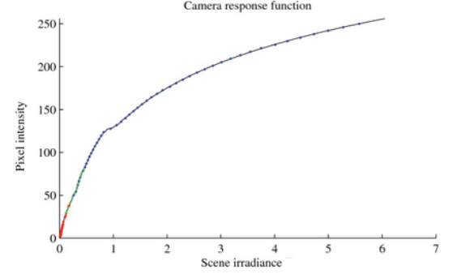
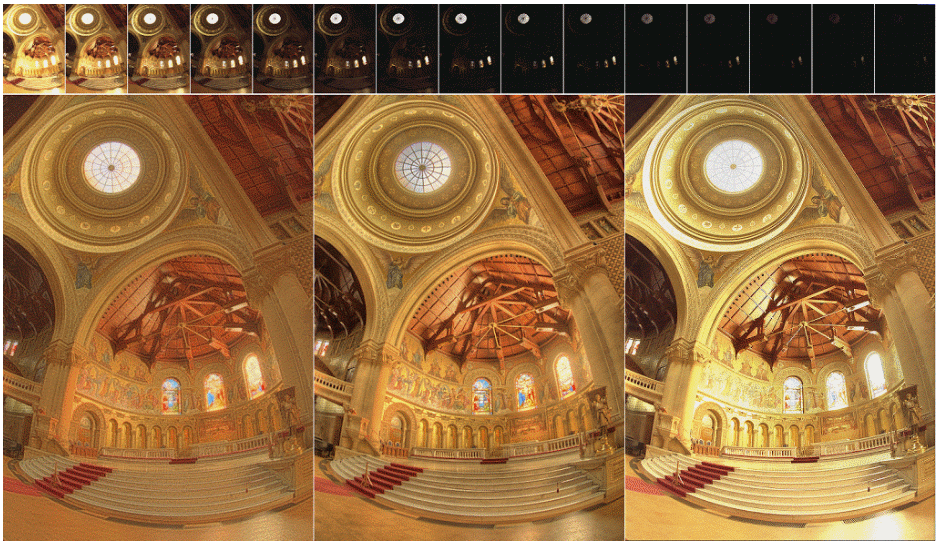
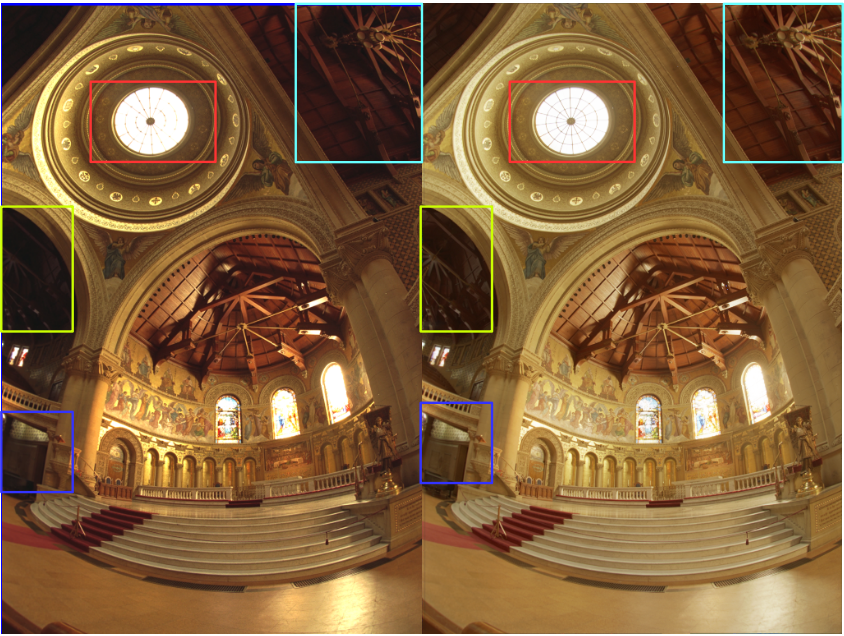
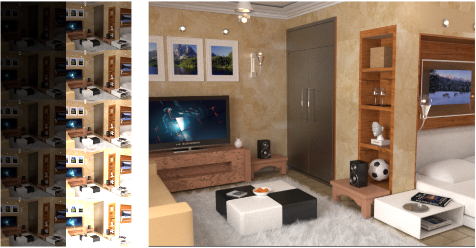
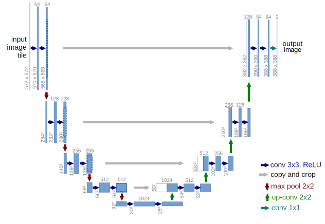
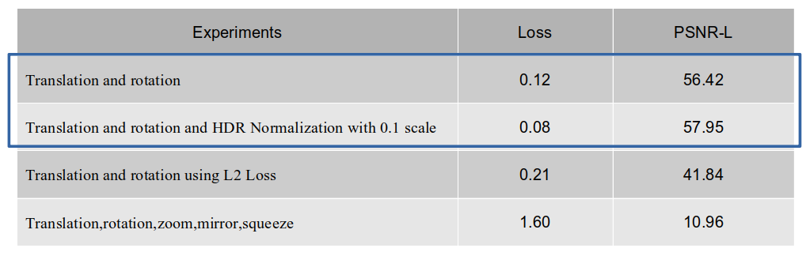
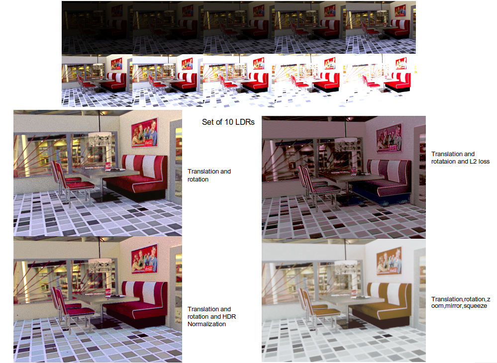
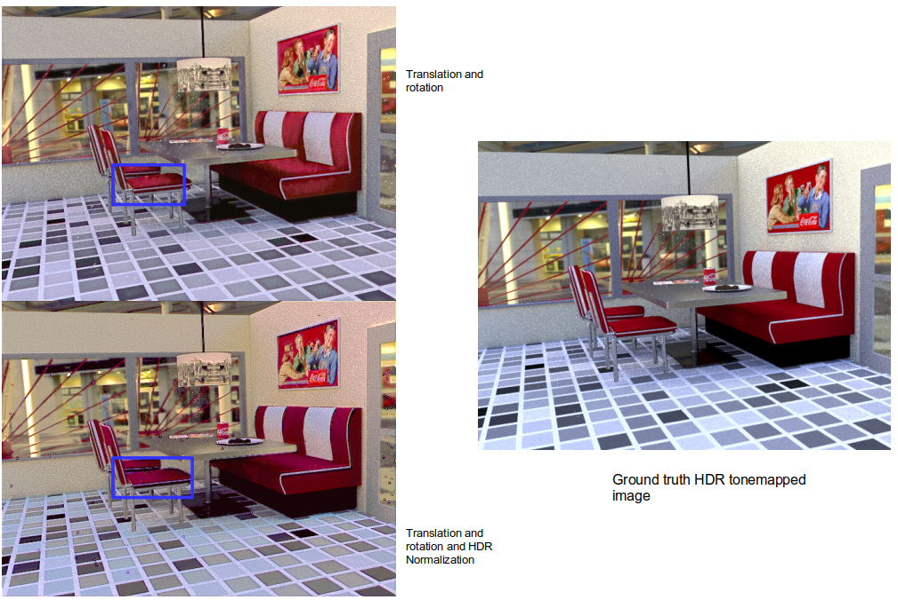

# Learning HDR Imaging from Synthetic data

## Objective

1.  Creation of a static dataset using blender
2.  Learn a model on the data
3.  Use the model to test real scenes

## Introduction

  *  LDR: Images of 0-255 pixel range, can be displayed on a standard device.
  *  HDR: Range of luminance that is equivalent to the one experienced by a human eye (upto 105).
  *  Tone-mapping: The scene with original irradiance(linear space) is mapped to pixel values of (0-255).

 

</ p>

 
 

## Motivation

  *  Image from DSLR camera cannot capture much details in very dark or very bright regions in one exposure setting.
  *  Surveillance or medical applications
  

 

 
 

## Approach

  *  Data set generation
  *  Learn a network model from the data set
  *  Run Experiements on the learned model
  
 

### Dataset generation

  *  Created using Blender seggregating them into 331 train and 75 test images.
  *  One scene was rendered multiple times in different exposures. The exposures ranged from EV:-5 to EV: +4.
  *  Render engines are Cycles render and Blender Render.
  *  The image resolution was kept to 640 X 480.

 

 

### Network Architecture

#### UNet

  *  19 Convolution layers, 4 Pooling layers and up-convolution
  *  3X3 kernel size, padding of 1, mini batch size 4
  *  Initial LR of 0.0001, gamma 0.1 and step size 20000
  *  ReLU activation, Adam Solver
  
 

 

## Experiments and Results

  *  The experiments were performed on 331 training images and 75 test images.
  *  Visualization after tone mapping using Gamma Correction

 
### Basic experiments
 

 

 

